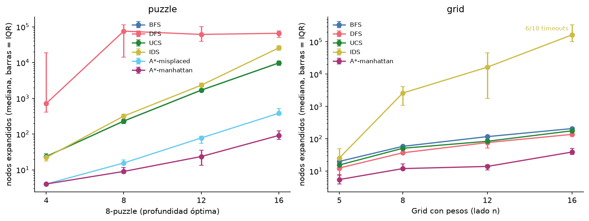
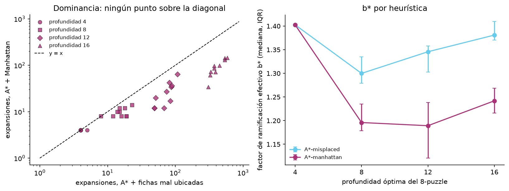
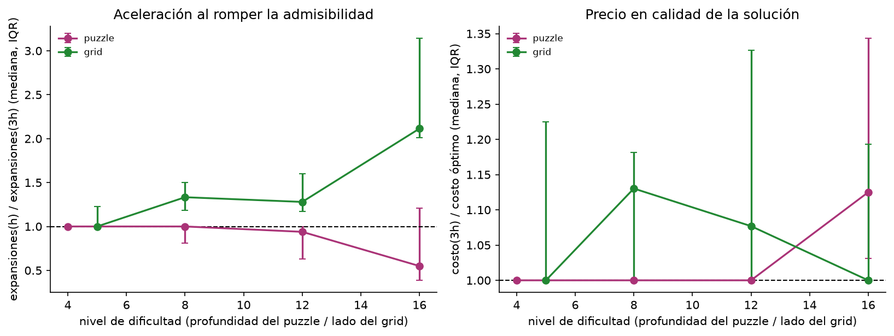
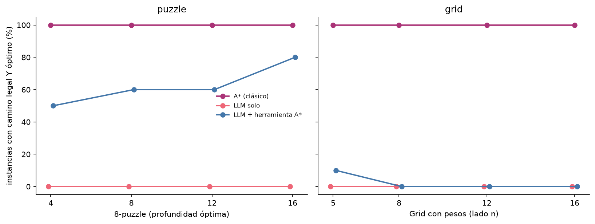
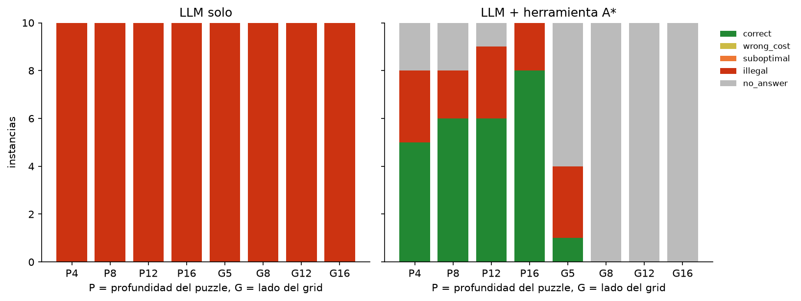

# Duelo 1 — Búsqueda

**Kevin Barrera(00333576), Juan Pablo Bastidas(00334808),Ayelén Jaramillo(00335334)** · CMP 4004 Inteligencia Artificial · USFQ, Otoño 2026

## Qué se hizo
Se compararon BFS, DFS, UCS, IDS y A* en dos dominios, 8-puzzle
(profundidades óptimas 4, 8, 12, 16) y grid con pesos (5×5, 8×8, 12×12, 16×16;
terreno `.`=1, `,`=3, `~`=8), con 10 instancias por nivel: 80 en total, de los
bancos de los studios. Las mismas 80 se dieron como texto a un modelo
(`qwen2.5:3b` en Ollama, temperatura 0) solo y con A* como herramienta: el modelo
emite una llamada JSON y el código corre A* sobre los argumentos que el modelo
escribió. Toda respuesta la re-ejecuta `code/validator.py` (camino legal, costo
recalculado, óptimo contra A*); al modelo nunca se le pregunta si acertó.
**Timeout duro: 10 s** por corrida clásica; un timeout se reporta como timeout.

## 1. Duel Scorecard

| Eje | Clásico (A*) | LLM | LLM + herramienta | Evidencia |
|---|---|---|---|---|
| Corrección | 80/80 | 0/80 | 26/80 | `results/duel_summary.csv` |
| Garantía | Devuelve un camino de costo mínimo **siempre que** h no sobreestime (verificado en los 181 440 estados del puzzle). No promete nada sobre el tiempo. | Ninguna. 0/80 no dice nada de la instancia 81. | Óptimo **solo si** el modelo llama a la herramienta, copia la instancia exacta y repite el resultado exacto. Ninguna condición está garantizada y las tres fallaron. | `code/tests`, `results/duel_runs.csv` |
| Costo | 12 expansiones (mediana) | 195 tokens (mediana) | 856 tokens + 12 expansiones | `results/duel_summary.csv` |
| Latencia (mediana / p95) | 0,09 ms / 0,5 ms | 0,23 s / 6,1 s | 0,97 s / 59,4 s | `results/duel_summary.csv` |
| Reproducibilidad | 1 respuesta distinta en 5 | 1 en 5 (T=0); 5 en 5 (T=0,8) | no medida | `results/repro.csv` |
| Escalamiento | corrección plana en 100 %; el costo crece (Fig. 1) | plano en 0 %, sin precipicio | precipicio entre 9 y 25 celdas (Fig. 4) | `fig/fig4_duel_scaling.png` |
| Interpretabilidad | camino + costo, comprobable contra UCS | un camino sin justificación | llamada JSON registrada y auditable | `.llm_cache/` |
| Modo de falla | timeout (solo IDS en 16×16); A* no falló | equivocado y seguro: 80 caminos ilegales | mal formado o sin llamada (41), ilegal (13) | `results/duel_runs.csv` |

**Categorías de falla** (80 instancias por sistema):

| Sistema | Correctas | Ilegal | Legal subóptimo | Óptimo con costo mal | Sin respuesta |
|---|---|---|---|---|---|
| A* | 80 | 0 | 0 | 0 | 0 |
| LLM | 0 | 80 | 0 | 0 | 0 |
| LLM + herramienta | 26 | 13 | 0 | 0 | 41 |

- **LLM:** 70 caminos se salen del tablero, 6 usan símbolos que no son
  movimientos y 4 no llegan a la meta. Las otras dos categorías quedan en 0
  porque ningún camino fue legal.
- **LLM + herramienta:** 25 aciertos en puzzle y 1 en grid. Copió bien 30 de 40
  puzzles y 1 de 40 grids. En 20 instancias no llamó a la herramienta, en 8 la
  llamó con la instancia mal copiada, en 21 grids ninguna llamada fue válida y en
  5 puzzles recibió el camino óptimo y lo repitió mal.
- 7 de las 41 "sin respuesta" son errores HTTP 500 de Ollama tras 4 reintentos,
  no respuestas del modelo; el p95 de latencia incluye esas esperas.

## 2. Figuras y resultados clásicos

Mediana (IQR) sobre 10 instancias en el nivel más difícil; los cuatro niveles
están en `results/classical_summary.csv`.

| 8-puzzle, prof. 16 | Costo | Longitud | Expansiones | Frontera máx. | Tiempo (ms) |
|---|---|---|---|---|---|
| BFS | 16 (0) | 16 (0) | 9 784 (2 743) | 5 794 (893) | 41,9 (9,2) |
| DFS | 63 683 (25 100) | 63 683 (25 100) | 66 216 (26 912) | 44 746 (16 034) | 314,1 (119,7) |
| UCS | 16 (0) | 16 (0) | 9 784 (2 743) | 5 794 (893) | 51,8 (18,4) |
| IDS | 16 (0) | 16 (0) | 25 858 (7 516) | 15 (0) | 116,3 (28,9) |
| A* misplaced | 16 (0) | 16 (0) | 383 (170) | 246 (93) | 2,5 (1,1) |
| A* Manhattan | 16 (0) | 16 (0) | 92 (50) | 68 (36) | 0,7 (0,4) |

| Grid 16×16 | Costo | Longitud | Expansiones | Frontera máx. | Tiempo (ms) |
|---|---|---|---|---|---|
| BFS | 32,0 (15,8) | 16,5 (4,5) | 208 (24) | 38 (7) | 0,80 (0,21) |
| DFS | 321,0 (63,2) | 137,5 (40,2) | 138 (40) | 148 (38) | 0,47 (0,10) |
| UCS | 19,5 (5,2) | 17,0 (5,2) | 177 (49) | 86 (8) | 0,80 (0,22) |
| IDS (4/10, **6 timeouts**) | 35,0 (7,8) | 12,5 (1,5) | 164 280 (237 712) | 26 (4) | 892,8 (1 344,6) |
| A* Manhattan | 19,5 (5,2) | 17,0 (5,2) | 39 (18) | 42 (19) | 0,24 (0,10) |



**Figura 1.** Concluir: los algoritmos no informados crecen exponencialmente con
la profundidad y A* con Manhattan queda dos órdenes de magnitud abajo (BFS está
tapado por UCS). En el grid se rompe IDS: sin conjunto de explorados re-expande
las mismas celdas y da timeout en 6 de 10 instancias de 16×16.

**UCS = A*; BFS no es óptimo con costos no uniformes.** UCS y A* devolvieron el
mismo costo en **80/80** instancias. BFS coincidió en los 40 puzzles y fue más
caro en **33/40 grids**: es óptimo solo con costos uniformes
(`results/optimality_check.csv`). Ejemplo, grid 5×5 instancia 2:

```
. S . . .
~ . . . .
. , G . ,
, . , ~ .
. ~ ~ . .
```

BFS devuelve `DDR` (1 + 3 + 1 = **5**); UCS y A* devuelven `DRD` (1 + 1 + 1 =
**3**).



**Figura 2.** Concluir: Manhattan domina a fichas mal ubicadas. Izquierda: ningún
punto sobre la diagonal, es decir, no expandió más nodos en **40/40** puzzles
(menos en 30, igual en 10; `results/dominance.csv`). Derecha: su factor de
ramificación efectivo b* es menor (1,24 contra 1,38 a profundidad 16; en el grid,
1,18 a 16×16; `results/ebf.csv`).



**Figura 3.** Concluir: romper la admisibilidad (h × 3) siempre cuesta optimalidad
y solo a veces compra velocidad. Grid 16×16: 2,11× menos expansiones (IQR
2,01–3,14), con 18/40 respuestas subóptimas (costo medio de las 40: +14,5 %; peor
caso: +87,5 %). 8-puzzle a profundidad 16: **0,55×**, es decir más lento (166 expansiones
contra 92), con 11/40 subóptimas y hasta 50 % más largas
(`results/weighted_astar.csv`).



**Figura 4.** Concluir:El LLM sin herramienta no muestra un cambio claro con el tamaño porque su tasa de optimalidad fue 0 % en todos los niveles. El brazo con herramienta sí muestra una caída importante, especialmente en los grids. Esto parece estar relacionado más con la dificultad de copiar correctamente la instancia y hacer la llamada que con la búsqueda A* en sí.



**Figura 5.** Concluir: los dos sistemas con modelo fallan distinto. El LLM solo
siempre contesta y siempre mal; con herramienta, la falla típica es no producir
respuesta.

## 3. Dónde pudimos haber sido injustos 

### ¿Afinamos la heurística y dejamos el prompt sin afinar?
Sí. Manhattan es una heurística conocida para estos problemas, mientras que el prompt del LLM solo se escribió una vez, sin ejemplos y sin un proceso de mejora. El prompt del brazo con herramienta sí fue cambiado dos veces después de observar los primeros errores. La primera versión pedía que el modelo hiciera la llamada y también escribiera la respuesta final en el mismo mensaje, y el modelo llegó a inventar resultados. Esa versión dio 0/80 en una corrida y otra versión llegó a 13/80. Los 26/80 corresponden a la tercera versión.

Por lo tanto, es posible que un prompt más trabajado hubiera mejorado el resultado del LLM solo. No podemos asumir que el 0/80 representa el máximo rendimiento posible del modelo.

### ¿La distribución de instancias favorece a un lado?
Sí, en ambas direcciones.
A favor del modelo: los grids no tienen paredes y la meta siempre queda abajo a la
derecha del inicio, así que "derecha y abajo" es legal por construcción; aun así
no acertó. A favor de A*: son instancias pequeñas, donde termina en menos de 1 ms
y nunca se acerca al timeout. Y el formato del grid como caracteres separados por
espacios perjudica al brazo con herramienta, que debe copiarlo.

### ¿Contamos nuestro tiempo de desarrollo?** 
No. El lado clásico costó varias horas de
código, pruebas y depuración, parte de este desarrollo también recibió ayuda de IA, como queda registrado en (`AI_LOG.md`); los promptstomaron minutos.


## 4. Lo que la evidencia no respalda
Hay varias conclusiones que no podemos sacar de este experimento.

1) Que el modelo pueda o no pueda resolver problemas más grandes. Por ejemplo, que el brazo con herramienta haya resuelto 8 de 10 puzzles de profundidad 16 no nos permite decir qué pasaría en profundidad 20.
2) Que un LLM "no pueda" resolver este tipo de problemas. El resultado de 0/80 corresponde a un modelo específico, un prompt específico y temperatura 0.
3) Que el resultado de 26/80 con herramienta sea estable. Cada instancia se ejecutó una vez y las versiones anteriores del prompt dieron resultados diferentes.
4) Que `h × 3` nunca acelere el 8-puzzle. Solamente probamos las profundidades indicadas en este trabajo.
5) Que la dominancia observada sea una conclusión general para cualquier implementación. Nosotros observamos la relación en estas 40 instancias y con nuestro criterio de desempate.
6) Que estos resultados representen grids con paredes, porque nuestro banco de pruebas no tenía paredes aunque el validador sí puede manejarlas.

En general, nuestro experimento muestra cómo se comportaron estos algoritmos y este modelo en estas instancias y bajo este protocolo. No demuestra que los resultados sean iguales para otros modelos, prompts, tamaños o tipos de problemas.


